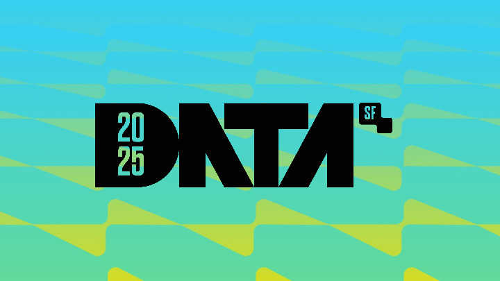
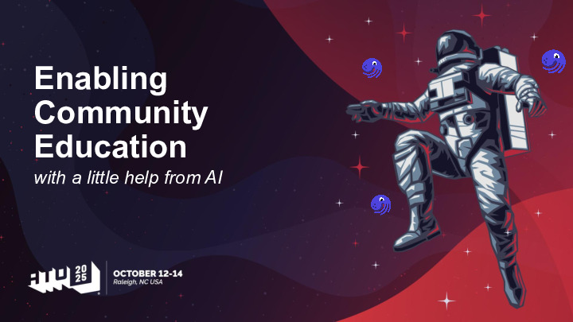
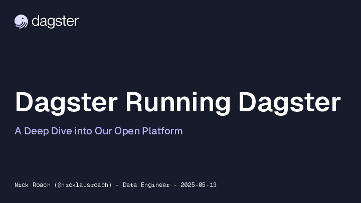
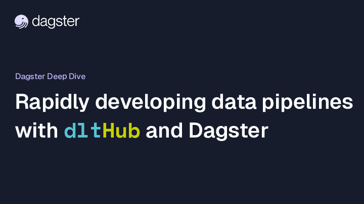
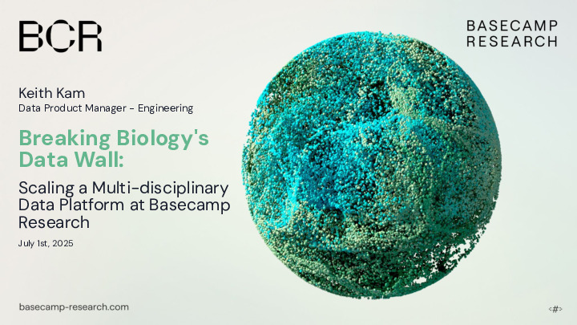
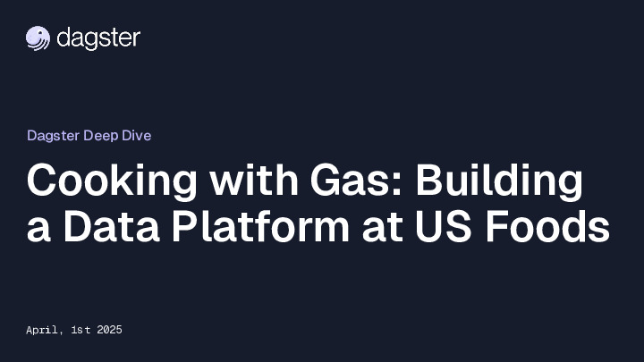
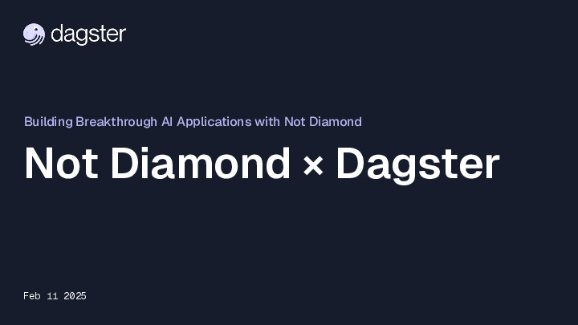
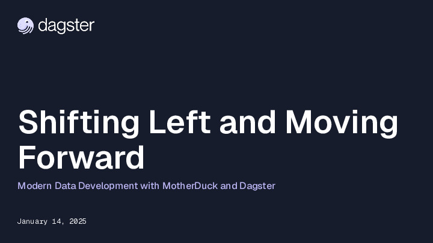

  

# Talks

This repository is home to presentations and demo projects created by the [Dagster](https://dagster.io) team.

If you have any questions, you are welcome to contact us on [Slack](https://dagster.io/slack), or through GitHub discussions.

## Table of Contents

- [Best Practices for LLM Development](#best-practices-for-llm-development)
- [Small Data - Composable Data Workflows: Building Pipelines That Just Work](#small-data---composable-data-workflows-building-pipelines-that-just-work)
- [All Things Open - Enabling community education](#all-things-open---enabling-community-education)
- [Deep Dive - Dagster Running Dagster: Streaming](#deep-dive---dagster-running-dagster-streaming)
- [Deep Dive - dltHub](#deep-dive---dlthub)
- [Deep Dive - Breaking Biology's Data Wall](#deep-dive---breaking-biologys-data-wall)
- [Deep Dive - Cooking with gas: Building a data platform at US Foods](#deep-dive---cooking-with-gas-building-a-data-platform-at-us-foods)
- [Deep Dive - Building Breakthrough AI Applications with Not Diamond](#deep-dive---building-breakthrough-ai-applications-with-not-diamond)
- [Deep Dive - Shifting Left and Moving Forward](#deep-dive---shifting-left-and-moving-forward)
- [Deep Dive - Orchestrating AI Agents](#deep-dive---orchestrating-ai-agents)
- [Deep Dive - The Evolution of Data Catalogs](#deep-dive---the-evolution-of-data-catalogs)
- [Deep Dive - Dagster Modal Demo](#deep-dive---dagster-modal-demo)
- [Building a True Data Platform: Beyond the Modern Data Stack](#building-a-true-data-platform-beyond-the-modern-data-stack)
- [Dagster, SDF, & the Evolution of the Data Platform](#dagster-sdf--the-evolution-of-the-data-platform)
- [Deep Dive - Data Quality](#deep-dive---data-quality)
- [Motherduck, Dagster, Evidence Demo](#motherduck-dagster-evidence-demo)
- [Deep Dive - Enable Data Mesh](#deep-dive---enable-data-mesh)
- [Deep Dive - Thinking in Partitions](#deep-dive---thinking-in-partitions)
- [Deep Dive - Resources & Configurations](#deep-dive---resources--configurations)
- [Deep Dive - Automations](#deep-dive---automations)

### Best Practices for LLM Development

> **📅 Date:** January 27, 2026
> **👥 Authors:** Alex Noonan, Dennis Hume, Colton Padden
> **🔗 Resources:** [Slides](https://github.com/dagster-io/talks/blob/main/slides/Deep Dive - Best Practices for LLM development .pdf)

Best Practices when using LLMs with Dagster

  

### Small Data - Composable Data Workflows: Building Pipelines That Just Work

> **📅 Date:** November 4, 2025
> **👥 Authors:** Dennis Hume
> **🔗 Resources:** [Slides](https://github.com/dagster-io/talks/blob/main/slides/small_data_workshop.pdf) • [Source Code](https://github.com/dehume/small-data-sf)

Learn how to use Dagster and DuckDB to build a Github deduplication pipeline

  

### All Things Open - Enabling community education

> **📅 Date:** October 14, 2025
> **👥 Authors:** Colton Padden
> **🔗 Resources:** [Slides](https://github.com/dagster-io/talks/blob/main/slides/all-things-open-2025-enabling-community-education.pdf)

See how the team at Dagster creates educational content for the community with a little help from AI.

  

### Deep Dive - Dagster Running Dagster: Streaming

> **📅 Date:** August 26, 2025
> **👥 Authors:** Nicholas Roach
> **🔗 Resources:** [Slides](https://github.com/dagster-io/talks/blob/main/slides/dagster-running-dagster_streaming.pdf)

Learn how Dagster performs streaming using Apache Flink for event log ingestion.

  

### Deep Dive - dltHub

> **📅 Date:** July 8, 2025
> **👥 Authors:** Alena Astrakhantseva, Aashish Nair, Colton Padden, Alex Noonan
> **🔗 Resources:** [Slides](https://github.com/dagster-io/talks/blob/main/slides/deep-dive-dlthub.pdf)

Rapidly developing data pipelines with dltHub and Dagster

  

### Deep Dive - Breaking Biology's Data Wall

> **📅 Date:** July 1, 2025
> **👥 Authors:** Keith Kam
> **🔗 Resources:** [Slides](https://github.com/dagster-io/talks/blob/main/slides/deep-dive-basecamp-research.pdf)

Scaling a multi-disciplinary data platform at Basecamp Research

  

### Deep Dive - Cooking with gas: Building a data platform at US Foods

> **📅 Date:** April 1, 2025
> **👥 Authors:** Lee Littlejohn, Alex Noonan
> **🔗 Resources:** [Slides](https://github.com/dagster-io/talks/blob/main/slides/deep-dive-us-foods.pdf)

Lee walks us through the data platform they've built around Dagster at US Foods.

  

### Deep Dive - Building Breakthrough AI Applications with Not Diamond

> **📅 Date:** February 11, 2025
> **👥 Authors:** Alejandro Companioni, Tomas Kofman, Colton Padden
> **🔗 Resources:** [Slides](https://github.com/dagster-io/talks/blob/main/slides/deep-dive-not-diamond.pdf)

In this deep dive we are joined by the Not Diamond team to explore how to build breakthrough AI applications by intelligently routing requests to the best-suited models for your application.

  

### Deep Dive - Shifting Left and Moving Forward

> **📅 Date:** January 14, 2025
> **👥 Authors:** Alex Noonan, Colton Padden, Jacob Matson
> **🔗 Resources:** [Slides](https://github.com/dagster-io/talks/blob/main/slides/deep-dive-motherduck-atproto-demo.pdf) • [Source Code](https://github.com/dagster-io/dagster/tree/master/examples/project_atproto_dashboard)

Modern Data Development with MotherDuck and Dagster

  

### Deep Dive - Orchestrating AI Agents

> **📅 Date:** October 31, 2024
> **👥 Authors:** Olivier Dupuis, Izzy Miller, Colton Padden
> **🔗 Resources:** [Slides](https://github.com/dagster-io/talks/blob/main/slides/deep-dive-orchestrating-ai-agents.pdf) • [Video](https://www.youtube.com/watch?v=vJpTTSsCuw8)

Orchestrating AI Agents with Hex and Dagster

  

### Deep Dive - The Evolution of Data Catalogs

> **📅 Date:** October 15, 2024
> **👥 Authors:** Alex Noonan
> **🔗 Resources:** [Slides](https://github.com/dagster-io/talks/blob/main/slides/deep-dive-data-catalogs.pdf) • [Video](https://www.youtube.com/watch?v=ogqCQvG9iVs)

The Evolution of Data Catalogs and Why They Matter

  

### Deep Dive - Dagster Modal Demo

> **📅 Date:** September 24, 2024
> **👥 Authors:** Charles Frye, Colton Padden
> **🔗 Resources:** [Slides](https://github.com/dagster-io/talks/blob/main/slides/deep-dive-dagster-modal-demo.pdf) • [Source Code](https://github.com/dagster-io/dagster-modal-demo) • [Video](https://www.youtube.com/watch?v=z_4KBYsyjks)

Orchestrating ML Workloads with Dagster & Modal

  

### Building a True Data Platform: Beyond the Modern Data Stack

> **📅 Date:** September 6, 2024
> **👥 Authors:** Pedram Navid
> **🔗 Resources:** [Slides](https://github.com/dagster-io/talks/blob/main/slides/building-a-true-data-platform.pdf) • [Video](https://www.youtube.com/watch?v=-L6ViEPnyLA)

  

### Dagster, SDF, & the Evolution of the Data Platform

> **📅 Date:** August 22, 2024
> **👥 Authors:** Lukas Schulte, Pedram Navid
> **🔗 Resources:** [Slides](https://github.com/dagster-io/talks/blob/main/slides/sdf.pdf) • [Video](https://www.youtube.com/watch?v=PTGjbCMnUSE)

  

### Deep Dive - Data Quality

> **📅 Date:** August 6, 2024
> **👥 Authors:** Colton Padden
> **🔗 Resources:** [Slides](https://github.com/dagster-io/talks/blob/main/slides/deep-dive-data-quality.pdf) • [Video](https://www.youtube.com/watch?v=vT0sSKEPE3A)

Learn the importance of data quality standards, and how to promote them in your organization

  

### Motherduck, Dagster, Evidence Demo

> **📅 Date:** April 18, 2024
> **👥 Authors:** Colton Padden, Alex, Monahan
> **🔗 Resources:** [Slides](https://github.com/dagster-io/talks/blob/main/slides/motherduck-dagster-evidence-hybrid-compute.pdf) • [Source Code](https://github.com/dagster-io/talks/tree/main/motherduck-dagster-hybrid-compute)

Explore the developer productivity gains of using tools like MotherDuck, Dagster, and Evidence.

  

### Deep Dive - Enable Data Mesh

> **📅 Date:** April 2, 2024
> **🔗 Resources:** [Source Code](https://github.com/dagster-io/data-mesh-demo) • [Video](https://www.youtube.com/watch?v=laEX2VSq_CQ)

Learn how the Data Mesh paradigm maps to Dagster and enables organizations.

### Deep Dive - Thinking in Partitions

> **📅 Date:** March 5, 2024
> **🔗 Resources:** [Slides](https://github.com/dagster-io/talks/blob/main/slides/03-deep-dive-partitions.pdf) • [Source Code](https://github.com/dagster-io/talks/tree/main/dagster-deep-dives/dagster_deep_dives/partitions) • [Video](https://www.youtube.com/watch?v=9U5OEQtDl-s)

See how pipelines can be parallelized and scale using Dagster partitions.

  

### Deep Dive - Resources & Configurations

> **📅 Date:** February 20, 2024
> **🔗 Resources:** [Slides](https://github.com/dagster-io/talks/blob/main/slides/02-deep-dive-resources.pdf) • [Source Code](https://github.com/dagster-io/talks/tree/main/dagster-deep-dives/dagster_deep_dives/resources_and_configurations) • [Video](https://www.youtube.com/watch?v=i6m7k16W-yg)

Learn how to a build a platform that promotes reusability and extensibility with configurations and resources.

  

### Deep Dive - Automations

> **📅 Date:** February 13, 2024
> **🔗 Resources:** [Slides](https://github.com/dagster-io/talks/blob/main/slides/01-deep-dive-automation.pdf) • [Source Code](https://github.com/dagster-io/talks/tree/main/dagster-deep-dives/dagster_deep_dives/automation) • [Video](https://www.youtube.com/watch?v=2JbBP8vR5o8)

Explore the concepts of _automation_ on the Dagster platform through cron-based schedules, sensors, and auto-materialization policies.

  

---

See [dagster-deep-dives/README.md](./dagster-deep-dives/README.md) for more information.
