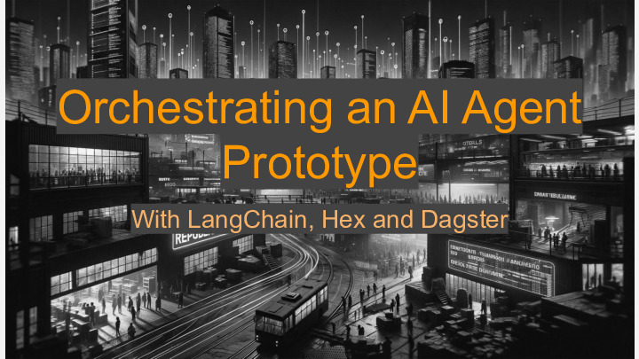
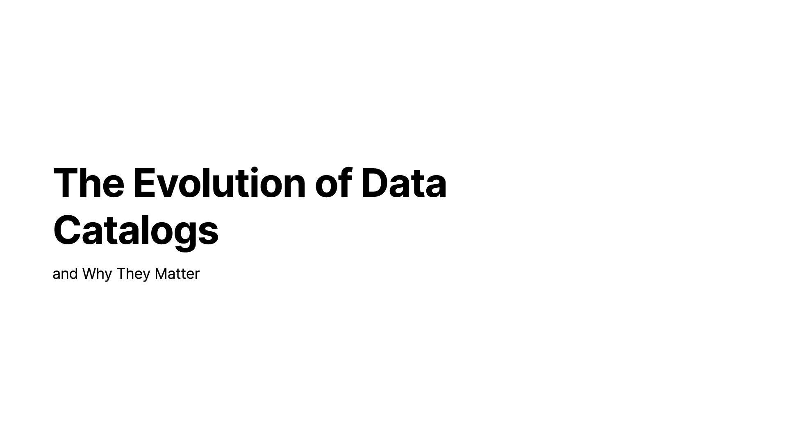
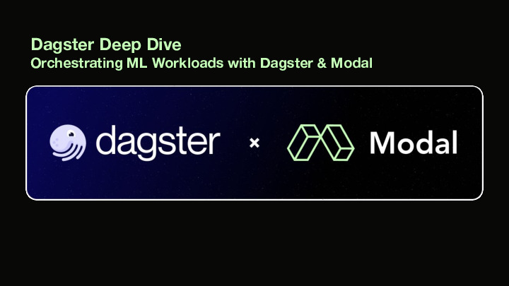
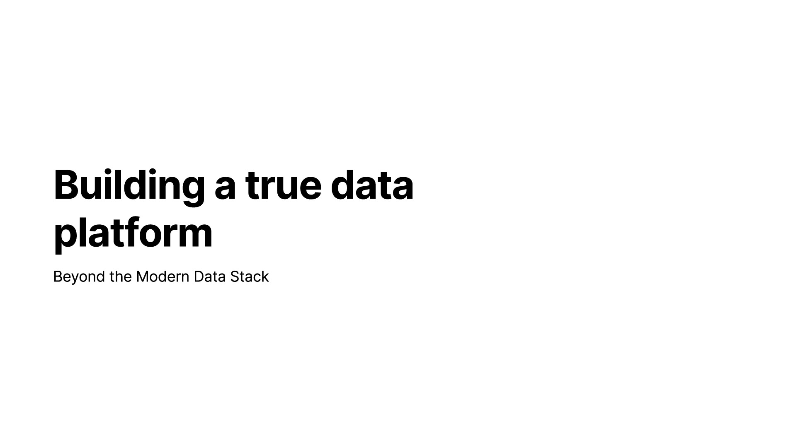
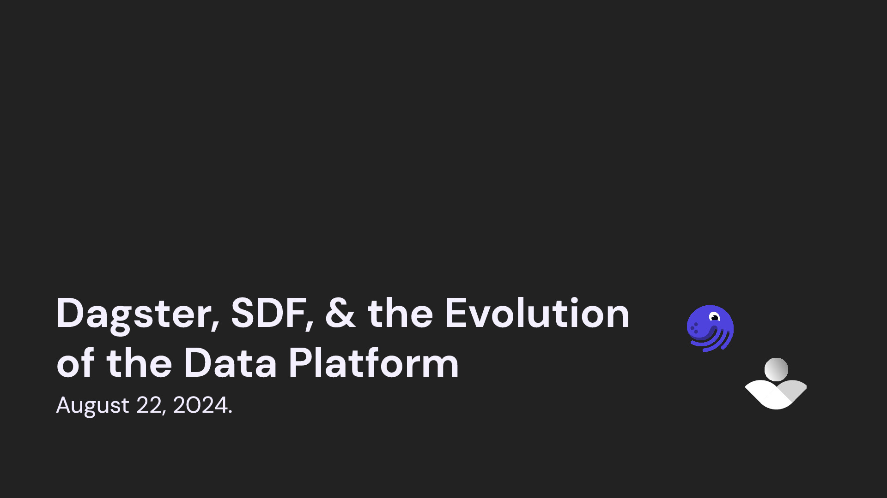
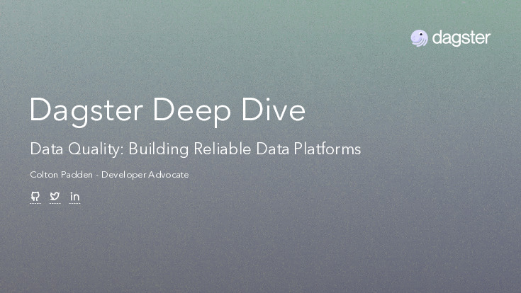
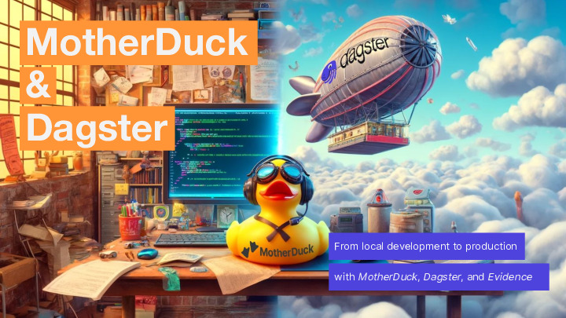
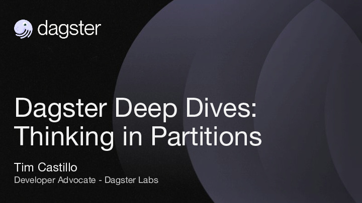
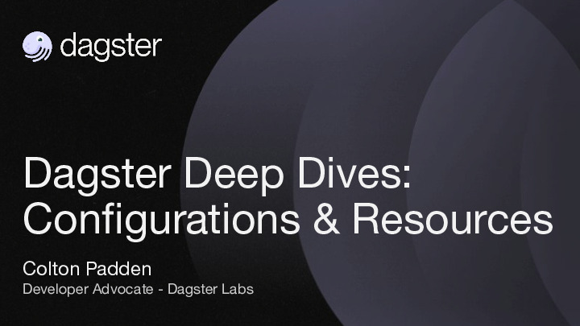
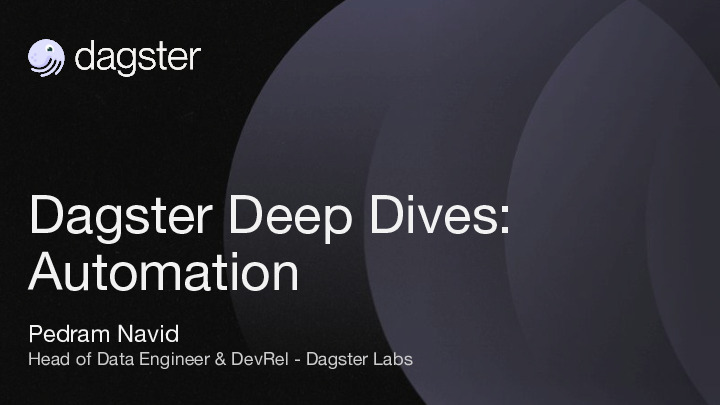

  

# Talks

This repository is home to presentations and demo projects created by the [Dagster](https://dagster.io) team.

If you have any questions, you are welcome to contact us on [Slack](https://dagster.io/slack), or through GitHub discussions.

## 2024-10-31 - Deep Dive - Orchestrating AI Agents

Author(s): Olivier Dupuis, Izzy Miller, Colton Padden

Orchestrating AI Agents with Hex and Dagster

[[Video]](https://www.youtube.com/watch?v=vJpTTSsCuw8)

  

## 2024-10-15 - Deep Dive - The Evolution of Data Catalogs

Author(s): Alex Noonan

The Evolution of Data Catalogs and Why They Matter

[[Video]](https://www.youtube.com/watch?v=ogqCQvG9iVs)

  

## 2024-09-24 - Deep Dive - Dagster Modal Demo

Author(s): Charles Frye, Colton Padden

Orchestrating ML Workloads with Dagster & Modal

[[Source Code]](https://github.com/dagster-io/dagster-modal-demo)
[[Video]](https://www.youtube.com/watch?v=z_4KBYsyjks)

  

## 2024-09-06 - Building a True Data Platform: Beyond the Modern Data Stack

Author(s): Pedram Navid

[[Video]](https://www.youtube.com/watch?v=-L6ViEPnyLA)

  

## 2024-08-22 - Dagster, SDF, & the Evolution of the Data Platform

Author(s): Lukas Schulte, Pedram Navid

[[Video]](https://www.youtube.com/watch?v=PTGjbCMnUSE)

  

## 2024-08-06 - Deep Dive - Data Quality

Author(s): Colton Padden

Learn the importance of data quality standards, and how to promote them in your organization

[[Video]](https://www.youtube.com/watch?v=vT0sSKEPE3A)

  

## 2024-04-18 - Motherduck, Dagster, Evidence Demo

Author(s): Colton Padden, Alex, Monahan

Explore the developer productivity gains of using tools like MotherDuck, Dagster, and Evidence.

[[Source Code]](https://github.com/dagster-io/talks/tree/main/motherduck-dagster-hybrid-compute)

  

## 2024-04-02 - Deep Dive - Enable Data Mesh

Learn how the Data Mesh paradigm maps to Dagster and enables organizations.

[[Source Code]](https://github.com/dagster-io/data-mesh-demo)
[[Video]](https://www.youtube.com/watch?v=laEX2VSq_CQ)

## 2024-03-05 - Deep Dive - Thinking in Partitions

See how pipelines can be parallelized and scale using Dagster partitions.

[[Source Code]](https://github.com/dagster-io/talks/tree/main/dagster-deep-dives/dagster_deep_dives/partitions)
[[Video]](https://www.youtube.com/watch?v=9U5OEQtDl-s)

  

## 2024-02-20 - Deep Dive - Resources & Configurations

Learn how to a build a platform that promotes reusability and extensibility with configurations and resources.

[[Source Code]](https://github.com/dagster-io/talks/tree/main/dagster-deep-dives/dagster_deep_dives/resources_and_configurations)
[[Video]](https://www.youtube.com/watch?v=i6m7k16W-yg)

  

## 2024-02-13 - Deep Dive - Automations

Explore the concepts of _automation_ on the Dagster platform through cron-based schedules, sensors, and auto-materialization policies.

[[Source Code]](https://github.com/dagster-io/talks/tree/main/dagster-deep-dives/dagster_deep_dives/automation)
[[Video]](https://www.youtube.com/watch?v=2JbBP8vR5o8)

  

---

See [dagster-deep-dives/README.md](./dagster-deep-dives/README.md) for more information.
